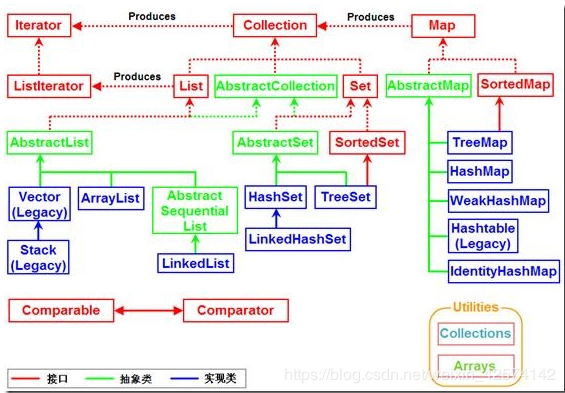
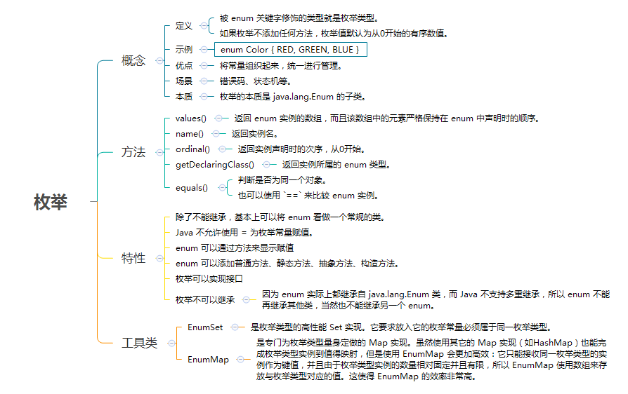
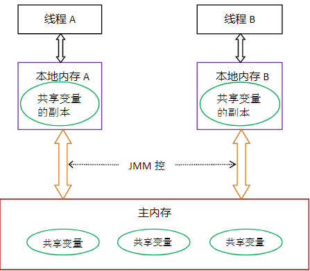

[泛型](#java-泛型)

[容器](#java-容器)

[注解](#java-注解)

[枚举](#java-枚举)

[并发编程](#java-并发编程)

[函数式编程](#java-函数式编程)

[书籍列表](https://github.com/wususu/effective-resourses/tree/master/Java)

主要推荐4本：java编程思想，java并发编程实践，Spring实战和深入理解java虚拟机。

## java 泛型
泛型，即“参数化类型”。一提到参数，最熟悉的就是定义方法时有形参，然后调用此方法时传递实参。那么参数化类型怎么理解呢？
顾名思义，就是将类型由原来的具体的类型参数化，类似于方法中的变量参数，此时类型也定义成参数形式（可以称之为类型形参），
然后在使用/调用时传入具体的类型（类型实参）。

### 泛型类
```java
class 类名称 <泛型标识：可以随便写任意标识号，标识指定的泛型的类型>{
  private 泛型标识 /*（成员变量类型）*/ var;
  .....

  }
}

//此处T可以随便写为任意标识，常见的如T、E、K、V等形式的参数常用于表示泛型
//在实例化泛型类时，必须指定T的具体类型
public class Generic<T>{
    //key这个成员变量的类型为T,T的类型由外部指定
    private T key;

    public Generic(T key) { //泛型构造方法形参key的类型也为T，T的类型由外部指定
        this.key = key;
    }

    public T getKey(){ //泛型方法getKey的返回值类型为T，T的类型由外部指定
        return key;
    }
}
```

```java
public void main(String[] args){
    //泛型的类型参数只能是类类型（包括自定义类），不能是简单类型
    //传入的实参类型需与泛型的类型参数类型相同，即为Integer.
    Generic<Integer> genericInteger = new Generic<Integer>(123456);

    //传入的实参类型需与泛型的类型参数类型相同，即为String.
    Generic<String> genericString = new Generic<String>("key_vlaue");
    Log.d("泛型测试","key is " + genericInteger.getKey());
    Log.d("泛型测试","key is " + genericString.getKey());

}
```
### 泛型接口

```java
//定义一个泛型接口
public interface Generator<T> {
    public T next();
}

/**
 * 未传入泛型实参时，与泛型类的定义相同，在声明类的时候，需将泛型的声明也一起加到类中
 * 即：class FruitGenerator<T> implements Generator<T>{
 * 如果不声明泛型，如：class FruitGenerator implements Generator<T>，编译器会报错："Unknown class"
 */
class FruitGenerator<T> implements Generator<T>{
    @Override
    public T next() {
        return null;
    }
}

/**
 * 传入泛型实参时：
 * 定义一个生产器实现这个接口,虽然我们只创建了一个泛型接口Generator<T>
 * 但是我们可以为T传入无数个实参，形成无数种类型的Generator接口。
 * 在实现类实现泛型接口时，如已将泛型类型传入实参类型，则所有使用泛型的地方都要替换成传入的实参类型
 * 即：Generator<T>，public T next();中的的T都要替换成传入的String类型。
 */
public class FruitGenerator implements Generator<String> {

    private String[] fruits = new String[]{"Apple", "Banana", "Pear"};

    @Override
    public String next() {
        Random rand = new Random();
        return fruits[rand.nextInt(3)];
    }
}

```
### 泛型方法

```java
        /*
         * 首先在public与返回值之间的<T>必不可少，这表明这是一个泛型方法，并且声明了一个泛型T
         * 这个T可以出现在这个泛型方法的任意位置.
         */
public <T> T showKeyName(Generic<T> container){
        System.out.println("container key :" + container.getKey());
        T test = container.getKey();
        return test;
    }
```

### 通配符

```java
//? 表示任意类型，为泛型添加上边界，即传入的类型实参必须是指定类型的子类型
public void showKeyValue1(Generic<? extends Number> obj){
    Log.d("泛型测试","key value is " + obj.getKey());
}

//? 表示任意类型，为泛型添加下边界，类型实参只准传入某种类型的父类
public void showKeyValue1(Generic<? super Number> obj){
    Log.d("泛型测试","key value is " + obj.getKey());
}
```

### 类型擦除

Java的泛型是伪泛型，这是因为Java在编译期间，所有的泛型信息都会被擦掉，
正确理解泛型概念的首要前提是理解类型擦除。Java的泛型基本上都是在编译器
这个层次上实现的，在生成的字节码中是不包含泛型中的类型信息的，使用泛型的
时候加上类型参数，在编译器编译的时候会去掉，这个过程成为类型擦除。
如在代码中定义List<Object>和List<String>等类型，在编译后都会变成List，
JVM看到的只是List，而由泛型附加的类型信息对JVM是看不到的。Java编译器会在
编译时尽可能的发现可能出错的地方，但是仍然无法在运行时刻出现的类型转换异常的
情况，类型擦除也是Java的泛型与C++模板机制实现方式之间的重要区别。

```java
List<String>[] lsa = new List<String>[10]; // Not really allowed.
Object o = lsa;
Object[] oa = (Object[]) o;
List<Integer> li = new ArrayList<Integer>();
li.add(new Integer(3));
oa[1] = li; // Unsound, but passes run time store check
String s = lsa[1].get(0); // Run-time error: ClassCastException.
```


## java 容器



#### Map接口 用于保存具有“映射关系”的数据。
类似于go中的map和php中的关联数组

- HashMap 数组+链表+红黑树， 判断两个key是否相等的标准，两个key通过equals()方法比较返回true、 同时两个key的hashCode值也必须相等
- LinkedHashMap 使用双向链表来维护key-value对的次序
- ConccurentHashMap 线程安全的HashMap，size() 计算不准确
- TreeMap 支持排序

```java
public void main(String[] args){
    Map<String, String> m = new HashMap();
    m.put("a", "b");
}
```

### Collection
是最基础的序列接口，有多种实现，包括了我们常用的数据结构
队列、栈、集合等
对应 go 中的数组切片 和php中的数组
#### List

有序的 collection（也称为序列）

- ArrayList 底层是数组，读取效率高，插入时需要动态扩容
- LinkedList 底层是链表，按顺序插入效率高，但读取效率低
- Vector 线程安全的， 底层是数组
```java
/*
  底层是数组，读取效率高，插入时需要动态扩容
*/
public class ArrayList<E>
extends AbstractList<E>
implements List<E>, RandomAccess, Cloneable, Serializable

/*
  底层是链表，按顺序插入效率高，但读取效率低
*/
public class LinkedList<E>
extends AbstractSequentialList<E>
implements List<E>, Deque<E>, Cloneable, Serializable

/*
  线程安全的
*/
public class Vector<E>
extends AbstractList<E>
implements List<E>, RandomAccess, Cloneable, Serializable

public void main(String[] args){
    List<String> l = new ArrayList();
    l.add(1);
}
```

#### Set接口

Set，顾名思义，集合的意思。java的集合和数学的集合一样，满足集合的无序性，确定性，单一性。


- HashSet HashSet是Set接口的典型实现，HashSet使用HASH算法来存储集合中的元素，因此具有良好的存取和查找性能。
- LinkedHashSet集合也是根据元素的hashCode值来决定元素的存储位置，但和HashSet不同的是，它同时使用链表维护元素的次序，这样使得元素看起来是以插入的顺序保存的。
- TreeSet 此接口主要用于排序操作


## java 注解
Java 注解用于为 Java 代码提供元数据。作为元数据，注解不直接影响你的代码执行。

- 定义注解
```java
package com.flypie.annotations;

import java.lang.annotation.Documented;
import java.lang.annotation.ElementType;
import java.lang.annotation.Inherited;
import java.lang.annotation.Retention;
import java.lang.annotation.RetentionPolicy;
import java.lang.annotation.Target;

/*    @Target,@Retention,@Inherited,@Documented
 *     这四个是对注解进行注解的元注解，负责自定义的注解的属性

 */
@Target({ElementType.TYPE,ElementType.METHOD})    //表示注解的作用对象，ElementType.TYPE表示类，ElementType.METHOD表示方法
@Retention(RetentionPolicy.RUNTIME)        //表示注解的保留机制，RetentionPolicy.RUNTIME表示运行时注解
@Inherited            //表示该注解可继承
@Documented            //表示该注解可生成文档
public @interface Design {
    String author();        //注解成员，如果注解只有一个成员，则成员名必须为value()，成员类型只能为原始类型
    int data() default 0;    //注解成员，默认值为0
}

public enum ElementType {
    TYPE,               /* 类、接口（包括注释类型）或枚举声明  */

    FIELD,              /* 字段声明（包括枚举常量）  */

    METHOD,             /* 方法声明  */

    PARAMETER,          /* 参数声明  */

    CONSTRUCTOR,        /* 构造方法声明  */

    LOCAL_VARIABLE,     /* 局部变量声明  */

    ANNOTATION_TYPE,    /* 注释类型声明  */

    PACKAGE             /* 包声明  */
}

public enum RetentionPolicy {
    SOURCE,            /* Annotation信息仅存在于编译器处理期间，编译器处理完之后就没有该Annotation信息了  */

    CLASS,             /* 编译器将Annotation存储于类对应的.class文件中。默认行为  */

    RUNTIME            /* 编译器将Annotation存储于class文件中，并且可由JVM读入 */
}
```

- 使用注解
```java
package com.flypie;

import com.flypie.annotations.Design;

@Design(author="flypie",data=100)    //使用自定义注解，有默认值的成员可以不用赋值，其余成员都要复值
public class Person {
    @Design(author="flypie",data=90)
    public void live(){

    }
}
```

- 解析注解
``` java
package com.flypie;

import java.lang.annotation.Annotation;
import java.lang.reflect.Method;

import com.flypie.annotations.Design;

public class Main {

    public static void main(String[] args) throws ClassNotFoundException {

        Class c=Class.forName("com.flypie.Person");        //使用类加载器加载类

        //1、找到类上的注解
        if(c.isAnnotationPresent(Design.class)){    //判断类是否被指定注解注解
            Design d=(Design) c.getAnnotation(Design.class);    //拿到类上的指定注解实例
            System.out.println(d.data());
        }

        //2、找到方法上的注解
        Method[] ms=c.getMethods();
        for(Method m:ms){
            if(m.isAnnotationPresent(Design.class)){    //判断方法是否被指定注解注解
                Design d=m.getAnnotation(Design.class);        //拿到类上的指定注解实例
                System.out.println(d.data());
            }
        }

        //3、另外一种方法
        for(Method m:ms){
            Annotation[] as=m.getAnnotations();        //拿到类上的注解集合
            for(Annotation a:as){
                if(a instanceof Design){        //判断指定注解
                    Design d=(Design) a;
                    System.out.println(d.data());
                }
            }
        }
    }

}
```


## java 枚举



展示enum的基本方法
```java
public class EnumMethodDemo {
    enum Color {RED, GREEN, BLUE;}
    enum Size {BIG, MIDDLE, SMALL;}
    public static void main(String args[]) {
        System.out.println("=========== Print all Color ===========");
        for (Color c : Color.values()) {
            System.out.println(c + " ordinal: " + c.ordinal());
        }
        System.out.println("=========== Print all Size ===========");
        for (Size s : Size.values()) {
            System.out.println(s + " ordinal: " + s.ordinal());
        }

        Color green = Color.GREEN;
        System.out.println("green name(): " + green.name());
        System.out.println("green getDeclaringClass(): " + green.getDeclaringClass());
        System.out.println("green hashCode(): " + green.hashCode());
        System.out.println("green compareTo Color.GREEN: " + green.compareTo(Color.GREEN));
        System.out.println("green equals Color.GREEN: " + green.equals(Color.GREEN));
        System.out.println("green equals Size.MIDDLE: " + green.equals(Size.MIDDLE));
        System.out.println("green equals 1: " + green.equals(1));
        System.out.format("green == Color.BLUE: %b\n", green == Color.BLUE);
    }
}
```

全面展示如何在枚举中定义普通方法、静态方法、抽象方法、构造方法
```java
public enum ErrorCode {
    OK(0) {
        public String getDescription() {
            return "成功";
        }
    },
    ERROR_A(100) {
        public String getDescription() {
            return "错误A";
        }
    },
    ERROR_B(200) {
        public String getDescription() {
            return "错误B";
        }
    };

    private int code;

    // 构造方法：enum的构造方法只能被声明为private权限或不声明权限
    private ErrorCode(int number) { // 构造方法
        this.code = number;
    }
    public int getCode() { // 普通方法
        return code;
    } // 普通方法
    public abstract String getDescription(); // 抽象方法
    public static void main(String args[]) { // 静态方法
        for (ErrorCode s : ErrorCode.values()) {
            System.out.println("code: " + s.getCode() + ", description: " + s.getDescription());
        }
    }
}
```

## java 函数式编程

是对匿名内部类的简化写法。
```java

@FunctionalInterface
public interface Runnable {
    /**
     * When an object implementing interface <code>Runnable</code> is used
     * to create a thread, starting the thread causes the object's
     * <code>run</code> method to be called in that separately executing
     * thread.
     * <p>
     * The general contract of the method <code>run</code> is that it may
     * take any action whatsoever.
     *
     * @see     java.lang.Thread#run()
     */
    public abstract void run();
}

// Java 8之前：
new Thread(new Runnable() {
    @Override
    public void run() {
    System.out.println("Before Java8, too much code for too little to do");
    }
}).start();

//Java 8方式：
new Thread( () -> System.out.println("In Java8, Lambda expression rocks !!") ).start();
```
## java 并发编程

### java线程
下面是线程的创建过程。不过在实际使用中最好使用线程池来创建线程。

```java

public class ThreadRuning extends Thread{

    public ThreadRuning(String name){
//重写构造，可以对线程添加名字
        super(name);
    }
    @Override
    public void run() {
        while(true){
            System.out.println("good time");
//在run方法里，this代表当前线程
            System.out.println(this);
        }
    }
    public static void main(String[] args){
        ThreadRuning threadRuning = new ThreadRuning("1111");
        threadRuning.start();
    }
}
```

### 线程池

```java
// Java线程池的完整构造函数
public ThreadPoolExecutor(
  int corePoolSize, // 线程池长期维持的线程数，即使线程处于Idle状态，也不会回收。
  int maximumPoolSize, // 线程数的上限
  long keepAliveTime, TimeUnit unit, // 超过corePoolSize的线程的idle时长，
                                     // 超过这个时间，多余的线程会被回收。
  BlockingQueue<Runnable> workQueue, // 任务的排队队列
  ThreadFactory threadFactory, // 新线程的产生方式
  RejectedExecutionHandler handler) // 拒绝策略
  
  //AbortPolicy 抛出RejectedExecutionException
  //DiscardPolicy 什么也不做，直接忽略
  //DiscardOldestPolicy 丢弃执行队列中最老的任务，尝试为当前提交的任务腾出位置
  //CallerRunsPolicy 直接由提交任务者执行这个任务
  ExecutorService executorService = new ThreadPoolExecutor(2, 2, 
                10, TimeUnit.SECONDS, 
                new ArrayBlockingQueue<>(512), // 使用有界队列，避免OOM
                new ThreadPoolExecutor.DiscardPolicy());
```


### 线程同步

- 尽量使用局部变量避免并发问题
```java
//使用ThreadLocal维护变量时，ThreadLocal为每个使用该变量的线程提供独立的变量副本，所以每一个线程都可以独立地改变自己的副本，而不会影响其它线程所对应的副本。
public class ThreadLocalTest {

     private static ThreadLocal<List<String>> threadLocal = new ThreadLocal<>();

    public void setThreadLocal(List<String> value) {

           threadLocal.set(value);
    }

    public void getThreadLocal() {

           threadLocal.get().foreach(name -> System.out.println(Thread.currentThread().getName()+"###" + name ));
    }


    public static void main(String[] args) {

             final ThreadLocalTest test = new ThreadLocalTest();

             new Thread(new Runnable() {
            @Override
            public void run() {
                List<String> strs = new ArrayList<String>();
                strs.add("1");
                strs.add("2");
                strs.add("3");
                t.setThreadLocal(strs);
                t.getThreadLocal();
            }
        },"t1").start();

        new Thread(new Runnable() {

            @Override
            public void run() {
                List<String> strs = new ArrayList<String>();
                strs.add("a");
                strs.add("b");
                t.setThreadLocal(strs);
                t.getThreadLocal();
            }
        },"t2").start();
    }

}
```

- volatile



```java
public class StoppableTask extends Thread {

  private volatile boolean pleaseStop;
  private int a = 0;

  //线程 1
  public void run() {
    while (!pleaseStop) {  //在读的时候保证是最新的值，使缓存失效
      System.out.println(a);
     // do some stuff...

    }

 }

  //线程 2
  public void tellMeToStop() {
   a = 1;
   pleaseStop = true; //在写的时候使缓存同步到主存中

  }

}
```

慎用volatile，虽然效率较高，但是很容易用错，最好只用于几个固定模式，保证使用正确。使用模式：状态标志，一次性安全发布等
[推荐文章-正确使用 Volatile 变量](https://www.ibm.com/developerworks/cn/java/j-jtp06197.html)

- 使用不可变对象

大多数情况下，对于资源互斥访问的场景，都是采用加锁的方式来实现对资源的串行访问，来保证并发安全，如synchronize关键字，Lock锁等。
但是这种方案最大的一个难点在于：在进行加锁和解锁时需要非常地慎重。如果加锁或者解锁时机稍有一点偏差，就可能会引发重大问题
不可变对象就是这样一种在创建之后就不再变更的对象，在java内存模型中，它们天生支持线程安全，让并发编程变得更简单。
    1. 对象创建以后状态不能修改
    2. 对象的所有域都是 `final` 域
    3. 对象是正确创建的

```java
@Immutable
class OneValueCache {
    private final BigInteger lastNumber;
    private final BigInteger[] lastFactors;

    /**
     * 假设在构造函数中没有使用 Arrays.copyOf()方法。那么域内不可变对象 lastFactors却能被域外代码改变
     * 那么 OneValueCache 就不是不可变的。
     */
    public OneValueCache(BigInteger i,
                         BigInteger[] factors) {
        lastNumber  = i;
        lastFactors = Arrays.copyOf(factors, factors.length);
    }

    public BigInteger[] getFactors(BigInteger i) {
        if (lastNumber == null || !lastNumber.equals(i))
            return null;
        else
            return Arrays.copyOf(lastFactors, lastFactors.length);
    }
}

@ThreadSafe
public class VolatileCachedFactorizer implements Servlet {
    private volatile OneValueCache cache =
        new OneValueCache(null, null);

    public void service(ServletRequest req, ServletResponse resp) {
        BigInteger i = extractFromRequest(req);
        BigInteger[] factors = cache.getFactors(i);
        if (factors == null) {
            factors = factor(i);
            cache = new OneValueCache(i, factors);//声明为 volatile 。防止指令重排序，保证可见性
        }
        encodeIntoResponse(resp, factors);
    }
}
```

- 使用并发容器和组件
    1. ConcurrentHashMap，CopyOnWriteArrayList，ConcurrentLinkedQueue，ArrayBlockingQueue等
    2. Semaphore，CyclicBarrier等类

- ReentrantLock与synchronized
```java
public class SynMethod {
    private static final Object staticLockObj = new Object();
    /**
     * 对象锁,代码级别,同一对象争用该锁,this为SynMethod实例,synchronized的锁绑定在this对象上
     */
    public void method1() {
        synchronized (this) {
            for (int i = 0; i < 5; i++) {
                System.out.println(Thread.currentThread().getName() + " synchronized loop " + i);
            }
        }
    }

    /**
     * 对象锁，方法级别,同一对象争用该锁,普通（非静态）方法,synchronized的锁绑定在调用该方法的对象上,与上一个写法含义一致
     */
    public synchronized void method2() {
        for (int i = 0; i < 5; i++) {
            System.out.println(Thread.currentThread().getName() + " synchronized loop " + i);
        }
    }

    /**
     * 对象锁，代码级别,同一类争用该锁,绑定在staticLockObj上,不同SynMethod实例,拥有同一个staticLockObj对象
     */
    public void method3() {
        synchronized (staticLockObj) {
            for (int i = 0; i < 5; i++) {
                System.out.println(Thread.currentThread().getName() + " synchronized loop " + i);
            }
        }
    }

    /**
     * 类锁,代码级别，同一类争用该锁
     */
    public void method4() {
        synchronized (SynMethod.class) {
            for (int i = 0; i < 5; i++) {
                System.out.println(Thread.currentThread().getName() + " synchronized loop " + i);
            }
        }
    }

    /**
     * 类锁,方法级别，同一类争用该锁,synchronized的锁绑定在SynMethod.class上
     */
    public static synchronized void staticMethod() {
        for (int i = 0; i < 5; i++) {
            System.out.println(Thread.currentThread().getName() + " synchronized loop " + i);
        }
    }
}
```

ReentrantLock 提供更灵活的锁实现,还支持公平锁，但是一般情况下尽量使用synchronized。
深入了解的话[推荐文章-ReentrantLock](https://www.jianshu.com/p/620f751d92ac) 这是个系列文章，对并发包的一些原理讲的很透彻。
```java
package com.journaldev.threads.lock;

import java.util.concurrent.TimeUnit;
import java.util.concurrent.locks.Lock;
import java.util.concurrent.locks.ReentrantLock;

public class ConcurrencyLockExample implements Runnable{

    private Resource resource;
    private Lock lock;

    public ConcurrencyLockExample(Resource r){
        this.resource = r;
        this.lock = new ReentrantLock();
    }

    @Override
    public void run() {
        try {
            if(lock.tryLock(10, TimeUnit.SECONDS)){
               resource.doSomething();
            }
        } catch (InterruptedException e) {
            e.printStackTrace();
        }finally{
            //release lock
            lock.unlock();
        }
        resource.doLogging();
    }

}
```


## java 虚拟机

